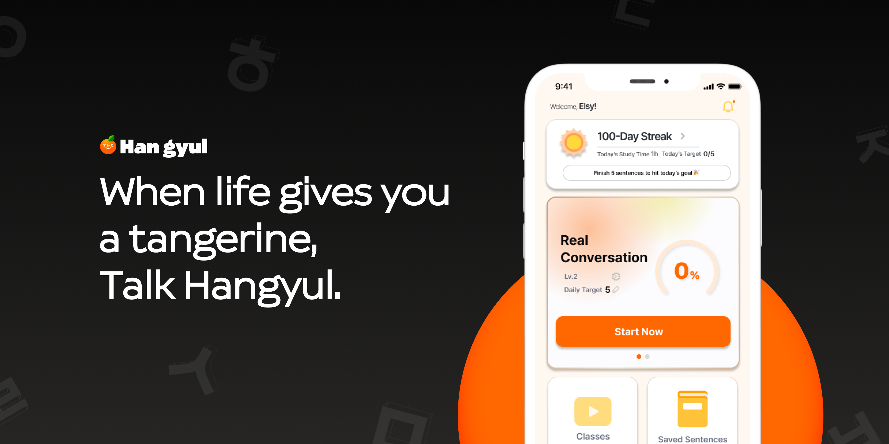

# Hangyul Web

AI 기반 한국어 학습 앱 Hangyul의 공식 랜딩 웹사이트입니다.
32개 언어 다국어 페이지, SEO 메타데이터, 접근성 대응, 법적 문서 모달, 앱 출시 전 CTA 흐름을 구현했습니다.

## 배포 링크

- Production: https://talkhangyul.com
- Korean: https://talkhangyul.com/ko
- English: https://talkhangyul.com/en

## 미리보기



## 주요 기능

- 32개 언어 다국어 라우팅 (아랍어 RTL 포함)
- locale별 이미지, 문구, SEO 메타데이터 제공
- 반응형 랜딩 페이지 UI
- 앱 다운로드 CTA 및 출시 예정 안내
- 이용약관/개인정보처리방침 모달
- URL query parameter 기반 legal modal 상태 관리
- sitemap, robots, Open Graph, canonical/alternate 메타데이터 구성
- Playwright 기반 E2E 테스트
- axe-core 기반 접근성 검사
- 번역 키 누락 검증 스크립트

## 기술 스택

- Next.js 16
- React 19
- TypeScript
- next-intl
- Framer Motion
- CSS Modules
- Playwright
- axe-core/playwright
- pnpm

## 구현 포인트

### 1. 다국어 구조

`next-intl`을 사용해 `/ko`, `/en`을 포함한 32개 locale 라우팅을 구성했습니다.
문구는 `messages/*.json`으로 분리하고, 이미지도 locale별로 다르게 노출되도록 구성했습니다.
(전용 스크린샷이 없는 locale은 영어 이미지를 사용합니다.)
아랍어는 `dir="rtl"`로 렌더링됩니다.

### 2. SEO 및 공유 최적화

locale별 title, description, keywords, Open Graph, canonical, alternate language metadata를 생성합니다.
검색 엔진과 SNS 공유 상황에서 각 언어 페이지가 적절히 노출되도록 설계했습니다.

### 3. URL 기반 법적 문서 모달

Footer의 이용약관/개인정보처리방침은 `?legal=terms`, `?legal=privacy` query parameter로 제어됩니다.
직접 URL 접근, 닫기 동작, 잘못된 query 값 처리까지 테스트로 검증했습니다.

### 4. 품질 검증

빌드 전 번역 키 검증 스크립트를 실행해 다국어 문구 누락을 방지했습니다.
Playwright E2E 테스트와 axe-core 접근성 테스트로 주요 사용자 흐름을 검증했습니다.

## 실행 방법

```bash
pnpm install
pnpm dev
```

개발 서버 실행 후 http://localhost:3000 에서 확인할 수 있습니다.

## 검증 명령어

```bash
pnpm lint
pnpm validate:i18n
pnpm test:e2e
pnpm build
```

## 프로젝트 구조

```txt
src/
  app/                 # Next.js App Router
  components/
    home/              # 랜딩 페이지 섹션
    layout/            # Header, Footer
    common/            # Modal, StoreButton 등 공통 UI
  constants/           # 이미지, 아이콘, 사이트 설정
  content/             # 약관/개인정보처리방침 본문
  i18n/                # next-intl 라우팅 및 요청 설정
messages/              # 다국어 메시지
tests/e2e/             # Playwright 테스트
scripts/               # 번역 검증 스크립트
```

## 트러블슈팅 / 개선 경험

- 애니메이션 중 axe-core가 색상 대비를 잘못 측정하는 문제를 테스트 환경에서 보정
- locale별 메타데이터와 OG locale 검증 테스트 추가
- legal modal의 브라우저 URL 상태와 UI 상태 동기화
- 번역 키 누락으로 인한 런타임 오류를 빌드 전에 차단

## 향후 개선

- 실제 앱스토어/플레이스토어 링크 연동
- QR 코드 실제 다운로드 링크 연결
- Lighthouse 성능 지표 개선
- CMS 또는 관리자 페이지를 통한 문구 관리
